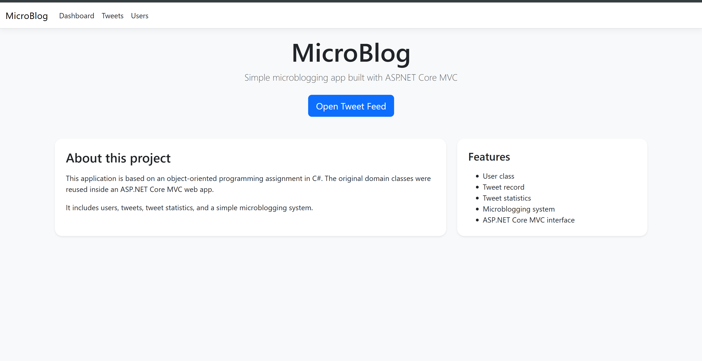
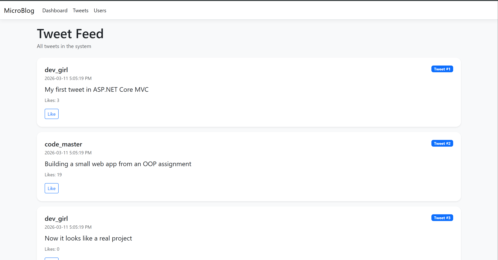
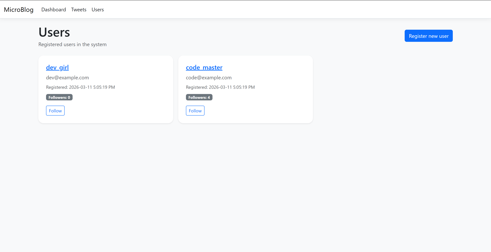
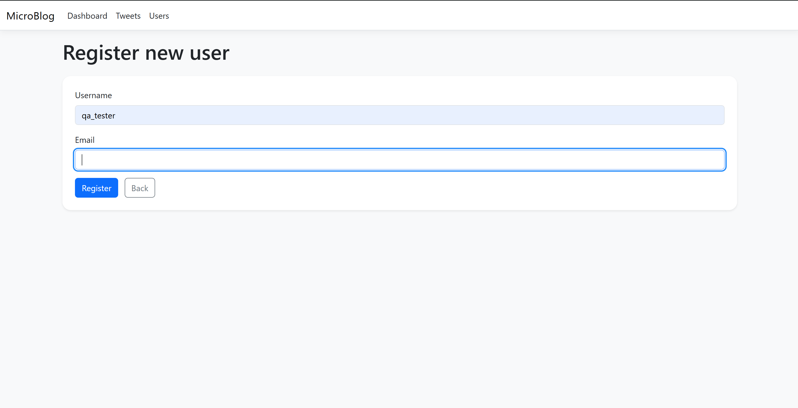
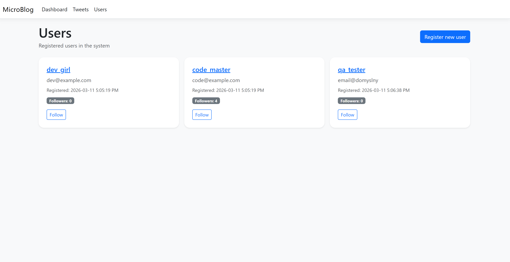

# MicroBlog.NET

Small microblogging web application built with **C#** and **ASP.NET Core MVC**.

This project started as an object-oriented programming assignment and was later adapted into a simple web application with a graphical interface.

## Features

- user registration
- tweet feed
- user list
- user details page
- follow users
- like tweets
- in-memory data storage

## Technologies

- C#
- ASP.NET Core MVC
- Bootstrap
- Object-Oriented Programming

## Project structure

- **Microblog.Core** – domain classes and microblogging logic
- **Microblog.Web** – ASP.NET Core MVC web interface

## OOP concepts used

- encapsulation
- constructors
- records
- structs
- immutable-style configuration

## Notes

This project uses in-memory storage, so data is reset after restarting the application.

## Screenshots

### Home page

### Tweet feed

### Users page

